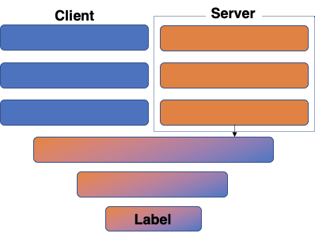

# Cloud Edge Learning
- Author : Tae Hyun Kim, Mindong Sung, Won Seok Jang
- Purpose : This code is a federated learning code in a real-world setting. 
```
    cloud2edge ┬ utils
               ├ models┬ Server
               │       ├ Client
               │       └ manager
               ├ manager
               ├ communication┬ sender
                              ├ receiver
                              
```



